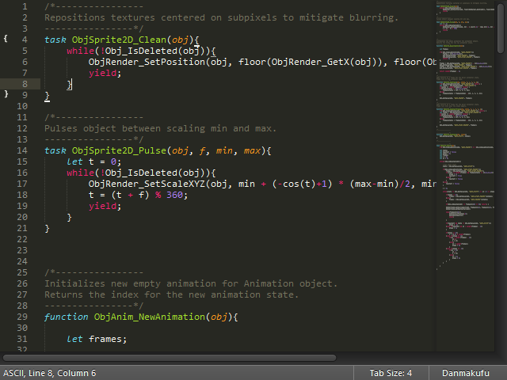
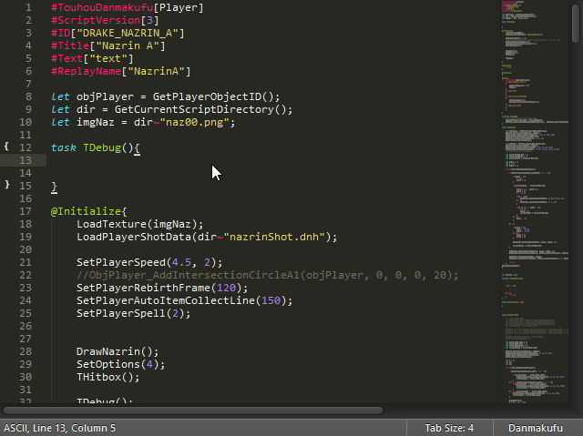
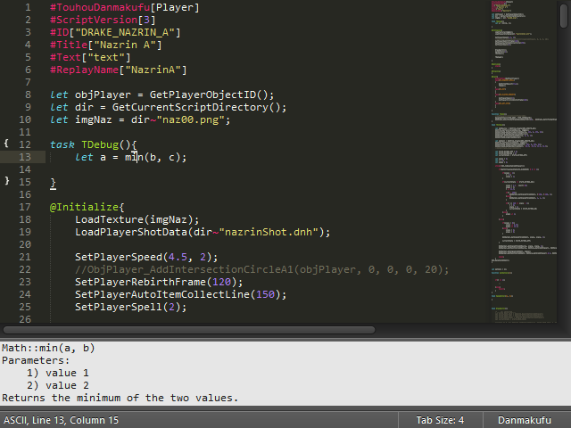

Touhou Danmakufu Plugin for Sublime Text
-----------------------------------------

### Description ###

This is a Sublime Text 2/3 package for the Touhou Danmakufu (東方弾幕風) scripting language. 
Designed for easy addition of support for arbitrary languages and enabling of further development because I felt like it. 

### Features ###

* Syntax highlighting for Danmakufu scripts (.dnh)

* Code completion for all ph3 engine library functions, with the standard fuzzy matching and tabbable parameters

* Function documentation\*, available in context menu and through ctrl+super+d by default

* Sublime is probably better than the editor you're using now, considering you write Danmakufu scripts







\*Note: I have not included the function documentation for the Danmakufu ph3 library itself, because it would take ages to write. Somebody please do this.

### Installation ###

* Install Package Control: https://sublime.wbond.net/installation and restart Sublime Text.

* Preferences → Package Control → Install Package → Danmakufu

### Extensibility ###

The codebase was written to be fairly generic, rather than adherent to just the DNH scripting language. If you want, you could write a completions/documentation dictionary for whatever other language. I tried to make this as easy as possible: all that's needed is a list of function signatures and a scope to apply them to. 

A dictionary file is a .sublime-settings file, which itself is really just JSON. The format of the file and of the function signatures should be apparent from the existing dictionary in [danmakufu-completions.sublime-settings](danmakufu-completions.sublime-settings).

Example:

```json
{
	"scope": "source.derplang",
	"dict":
	[
		{ "sig": "class::func(x, y)\tobject" },
		{ "sig": "a()" }
	]

}
```

### License ###
what license